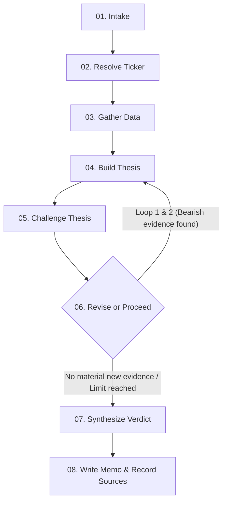

# ParakhIQ — AI Equity Research Terminal

ParakhIQ is a dense, high-utility, terminal-grade investment research agent. Built as a full-stack Next.js application, it automates equity analysis by generating structured investment theses, challenging its own findings using targeted search loops, rendering profile-tailored verdicts (Invest / Pass), tracking portfolios, and delivering daily morning digests via SMTP email.

---

## How It Works (Agent Architecture)

The core engine is orchestrated as a stateful graph using **LangGraph.js** and **Gemini 2.5 Flash**:



1. **intake**: Parses company name & user investor profile (Conservative vs Aggressive).
2. **resolve_ticker**: Employs Yahoo Finance search to resolve name to stock ticker, prioritizing Indian NSE (`.NS`) or BSE (`.BO`) tickers with global fallbacks.
3. **gather_data**: Pulls 1-year historical price data & fundamentals (P/E, Market Cap, 52W range, Debt/Equity, Promoter Holdings) from Yahoo Finance, and news sentiment articles from Tavily.
4. **build_thesis**: ChatGoogleGenerativeAI synthesizes data to build an initial investment thesis.
5. **challenge_thesis**: Targeted Tavily search looks for bearish evidence against the company (e.g. debt issues, critiques, market drops). Gemini evaluates if this is a material challenge.
6. **revise_or_proceed (Conditional Routing)**: If material bearish evidence is found, loops back to build_thesis (max 2 times) to refine the thesis. Otherwise, proceeds.
7. **synthesize_verdict**: Gemini generates an Invest/Pass verdict, confidence score, profile-tailored reasoning, and 3-5 explicit, measurable "kill criteria".
8. **write_memo**: Formats and packages output into a clean, terminal-style structured report, archiving all source citations used during the analysis.

> **Feature Note**: The platform also supports **Live Profile Toggling** (which dynamically recalculates the verdict based on cached memos), **PDF Exports**, and **Public Shareable Links** for completed research runs.

---

## 1-Year Prediction Engine

For portfolio holdings, predictions are computed as a **range** with a **midpoint** (e.g., `+8% to +22%, midpoint +15%`) by combining:
- **Historical Trend Extrapolation**: Annualized linear regression slope over 1-year price history.
- **News Sentiment Score**: Gemini-derived sentiment score (-1 to +1) over the ~20 most recent articles fetched via Tavily.

---

## Key Decisions & Trade-Offs

- **Gemini-Only (gemini-2.5-flash)**: We use Gemini 2.5 Flash via `@langchain/google-genai` for all reasoning and structured Zod parsing. It is extremely fast, highly capable at structured JSON output, and operates entirely within Gemini's generous free tier.
- **Supabase for Auth + Database**: Choosing Supabase allows us to handle User Management (email/password auth), Anonymous Sign-Ins (Guest Mode), and Postgres relational database schemas under a single unified SDK. This significantly reduced configuration overhead compared to a fragmented NextAuth + external DB stack.
- **Aggregated Portfolio View vs Individual Tracking**: We implemented a macro-level overview (donut charts, weighted predictions, concentration warnings) to complement individual holding metrics, making the portfolio page a holistic dashboard.
- **Range Predictions vs. Point Estimates**: We deliberately output a 1-year prediction range rather than a single point estimate. Financial markets are stochastic, and presenting a false-precision point estimate is misleading. A range combined with news sentiment provides a realistic, heuristic estimation of price direction.
- **Visual reasoning stepper**: Instead of exposing the agent as a chat bubble, intermediate states are streamed via Server-Sent Events (SSE) and rendered as a visual stepper (Thesis → Challenge → Revision → Verdict) for maximum transparency.

---

## Database Schema (Postgres)

- **`holdings`**: Tracks company name, ticker, sector, and amount intended to invest per user.
- **`predictions`**: Tracks chronological prediction ranges, sentiment scores, and directional guidance (`hold`, `reconsider`, `reduce`) over time per holding (enabling charting progress).
- **`research_history`**: Caches full analysis runs, source citations, investor profile verdicts, and public sharing configurations, acting as a historical ledger.
- **`user_preferences`**: Stores user email digest settings (`email_digest_enabled`).

---

## Setup & Running Locally

### 1. Prerequisites
- Node.js 18+ installed.
- A free Supabase project. Ensure you enable **Anonymous Sign-ins** in the Supabase Dashboard under *Authentication* → *Providers*.

### 2. Configure Environment Variables
Create a `.env` file at the root (use `.env.example` as a template):
```env
GEMINI_API_KEY=your_gemini_api_key
TAVILY_API_KEY=your_tavily_api_key

NEXT_PUBLIC_SUPABASE_URL=your_supabase_url
NEXT_PUBLIC_SUPABASE_ANON_KEY=your_supabase_anon_key
SUPABASE_SERVICE_ROLE_KEY=your_supabase_service_role_key

GMAIL_USER=your_gmail_sender@gmail.com
GMAIL_APP_PASSWORD=your_gmail_16_char_app_password

CRON_SECRET=your_custom_cron_security_secret
NEXT_PUBLIC_APP_URL=http://localhost:3000
```

### 3. Setup Database Schema
Paste and run the contents of [supabase/migration.sql](file:///e:/Placements/InsideIIM/ParakhIQ/supabase/migration.sql) inside the Supabase SQL Editor.

### 4. Install & Run
```bash
npm install
npm run dev
```
Open [http://localhost:3000](http://localhost:3000) to view the terminal.

---

## What We'd Improve with More Time

1. **Backtesting Engine**: Allow users to run the prediction model retroactively over historical 5-year periods and visualize the accuracy of the directional predictions.
2. **Advanced Charting**: Integrate real Candlestick charts with technical indicators (RSI, MACD) in Recharts rather than simple Area price lines.
3. **Broad Exchange Support**: Add support for global exchanges (NYSE, NASDAQ, LSE) with live currency conversions to INR.
4. **WebSocket Streaming**: Transition from SSE streaming to two-way WebSockets for even faster real-time log updates.
5. **Headless Browser PDF Export**: We deliberately simplified PDF generation to run via `jspdf` on the client/edge for Vercel compatibility, rather than using a heavy Puppeteer server-side headless browser.

