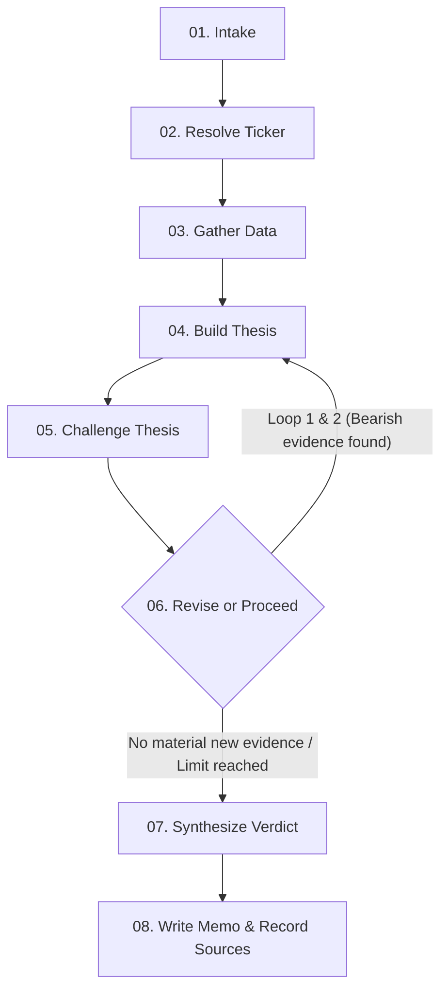

# ParakhIQ — AI Equity Research Terminal

> **Project Links**:
> - 👉 **[View Example Runs & Outputs Document](https://drive.google.com/file/d/1cj5msaRq2aT-QdcC9sZjh4HJesu9n3J6/view?usp=sharing)**
> - 👉 **[View LLM Chat Session Transcripts & Logs](https://drive.google.com/file/d/1ZE_Aj0WZg1t4CjInnU5H8lM6DoWD70LL/view?usp=sharing)**

---

ParakhIQ is a dense, high-utility, terminal-grade investment research agent. Built as a full-stack Next.js application, it automates equity analysis by generating structured investment theses, challenging its own findings using targeted search loops, rendering profile-tailored verdicts (Invest / Pass), tracking portfolios, and delivering daily morning digests via SMTP email.

---

## Overview — What it does

ParakhIQ acts as an automated equity analyst that delivers terminal-grade financial research. It performs the following functions:
- **Ticker Resolution**: Resolves arbitrary company names (Indian and US) to active stock tickers (e.g. NSE `.NS` tickers or US tickers like `AAPL`).
- **Autonomous Research Agent**: A stateful graph agent fetches real-time market data, key metrics, and news sentiment, drafts an initial thesis, aggressively challenges its own conclusions via internet research loops, and provides a final verdict (Invest / Pass).
- **Dynamic Profile Verdicts**: Tailors verdicts and "Kill Criteria" based on investor profiles (Conservative vs. Aggressive). Verdicts can be dynamically recalculated in seconds by using cached research sources.
- **Portfolio Tracker & Diagnostics**: Automatically tracks intended investments, calculates real-time profit and loss (P&L), extrapolates 1-year prediction ranges, and displays a macro-level dashboard with sector distribution donut charts and concentration alerts.
- **PDF Reports & Sharing**: Generates clean, stylized PDF reports for any research and lets users publish research runs to unique public shareable URLs.
- **Morning Digests**: Delivers a scheduled morning digest containing portfolio performance, price trends, and updated AI prediction ranges straight to your email.
- **Guest Mode**: Seedes guest users with demo data, holdings, and research histories immediately upon session startup to prevent empty-UI cold starts.

---

## How to run it — setup and run steps (plus any keys/ env needed)

### 1. Prerequisites
- **Node.js** 18+ installed on your system.
- A free **Supabase** project. Ensure you enable **Anonymous Sign-ins** in the Supabase Dashboard under *Authentication* → *Providers*.
- **Gmail Account** (if using email digests) with an App Password generated.

### 2. Configure Environment Variables
Create a `.env` file at the root of the project (use `.env.example` as a template):
```env
GEMINI_API_KEY=your_gemini_api_key
TAVILY_API_KEY=your_tavily_api_key
TWELVE_DATA_API_KEY=your_twelve_data_api_key

NEXT_PUBLIC_SUPABASE_URL=your_supabase_url
NEXT_PUBLIC_SUPABASE_ANON_KEY=your_supabase_anon_key
SUPABASE_SERVICE_ROLE_KEY=your_supabase_service_role_key

GMAIL_USER=your_gmail_sender@gmail.com
GMAIL_APP_PASSWORD=your_gmail_16_char_app_password

CRON_SECRET=your_custom_cron_security_secret
NEXT_PUBLIC_APP_URL=http://localhost:3000
```

### 3. Setup Database Schema
1. Open the SQL Editor in your Supabase Dashboard.
2. Paste and run the baseline database schema from [supabase/migration.sql](file:///e:/Placements/InsideIIM/ParakhIQ/supabase/migration.sql).
3. Paste and run the V2 updates migration from [supabase/migration_v2.sql](file:///e:/Placements/InsideIIM/ParakhIQ/supabase/migration_v2.sql).

### 4. Install & Run
Run the following commands in your shell:
```bash
# Install dependencies
npm install

# Run the local development server
npm run dev
```
Open [http://localhost:3000](http://localhost:3000) to view the terminal.

---

## How it works — your approach and architecture

The system combines a stateful multi-agent system built with **LangGraph.js** and a client-side visualization interface.

### 1. Agent Architecture (Stateful Graph)
The core research loop is orchestrated using **LangGraph.js** and **Gemini 2.5 Flash**:



- **intake**: Obtains the query and target investor profile (Conservative vs. Aggressive).
- **resolve_ticker**: Employs Yahoo Finance search to resolve name to stock ticker, prioritizing Indian NSE (`.NS`) or BSE (`.BO`) tickers with global fallbacks.
- **gather_data**: Pulls 1-year historical price data & fundamentals (P/E, Market Cap, 52W range, Debt/Equity, Promoter Holdings) from Yahoo Finance, and news sentiment articles from Tavily.
- **build_thesis**: ChatGoogleGenerativeAI synthesizes data to build an initial investment thesis.
- **challenge_thesis**: Targeted Tavily search looks for bearish evidence against the company (e.g. debt issues, critiques, market drops). Gemini evaluates if this is a material challenge.
- **revise_or_proceed (Conditional Routing)**: If material bearish evidence is found, loops back to build_thesis (max 2 times) to refine the thesis. Otherwise, proceeds.
- **synthesize_verdict**: Gemini generates an Invest/Pass verdict, confidence score, profile-tailored reasoning, and 3-5 explicit, measurable "kill criteria".
- **write_memo**: Formats and packages output into a clean, terminal-style structured report, archiving all source citations used during the analysis.

### 2. 1-Year Prediction Engine
For portfolio holdings, predictions are computed as a **range** with a **midpoint** (e.g., `+8% to +22%, midpoint +15%`) by combining:
- **Historical Trend Extrapolation**: Annualized linear regression slope over 1-year price history.
- **News Sentiment Score**: Gemini-derived sentiment score (-1 to +1) over the ~20 most recent articles fetched via Tavily.

---

## Key decisions & trade-offs — what you chose and why, and what you left out

- **Gemini-Only (gemini-2.5-flash)**: We use Gemini 2.5 Flash via `@langchain/google-genai` for all reasoning and structured Zod parsing. It is extremely fast, highly capable at structured JSON output, and operates entirely within Gemini's generous free tier.
- **Supabase for Auth + Database**: Choosing Supabase allows us to handle User Management (email/password auth), Anonymous Sign-Ins (Guest Mode), and Postgres relational database schemas under a single unified SDK. This significantly reduced configuration overhead compared to a fragmented NextAuth + external DB stack.
- **Client-Side/Edge PDF Generation**: PDF exports are generated using `jspdf` directly on the client, which avoids spawning heavy, slow, server-side Puppeteer headless browser processes, making the app much easier to deploy on standard edge hosting providers like Vercel.
- **Range Predictions vs. Point Estimates**: We deliberately output a 1-year prediction range rather than a single point estimate. Financial markets are stochastic, and presenting a false-precision point estimate is misleading. A range combined with news sentiment provides a realistic, heuristic estimation of price direction.
- **What We Left Out**:
  - *Backtesting Engine*: Left out due to the complexity and API rate-limiting constraints of retroactively pulling years of daily price data for multiple assets.
  - *Real-time Socket streaming*: Used Server-Sent Events (SSE) instead of WebSockets because SSE is native to HTTP/2 and does not require managing persistent stateful socket connections on Next.js serverless functions.

---

## Example runs — your agent’s output on a few companies of your choice

You can find the detailed outputs, screenshots, and visual walkthroughs of the agent's research runs on several companies (including Reliance, Microsoft, and TCS) at the link below:

👉 **[View Example Runs Document](https://drive.google.com/file/d/1cj5msaRq2aT-QdcC9sZjh4HJesu9n3J6/view?usp=sharing)**

---

## What you would improve with more time

1. **Backtesting Engine**: Allow users to run the prediction model retroactively over historical 5-year periods and visualize the accuracy of the directional predictions.
2. **Advanced Charting**: Integrate real Candlestick charts with technical indicators (RSI, MACD) in Recharts rather than simple Area price lines.
3. **Broad Exchange Support**: Add support for global exchanges (NYSE, NASDAQ, LSE) with live currency conversions to INR.
4. **WebSocket Streaming**: Transition from SSE streaming to two-way WebSockets for even faster real-time log updates.
5. **Headless Browser PDF Export**: Transition to a serverless Puppeteer export service for pixel-perfect PDF rendering of dynamic Recharts graphs.

---

## LLM Chat Session Transcript & Logs

This project was built pair-programming with a choice of AI/LLM. The complete raw conversation transcripts, detailing the prompt engineering, bug fixes, architecture planning, and interactive design sessions, can be accessed below:

👉 **[View LLM Chat Session Transcripts](https://drive.google.com/file/d/1ZE_Aj0WZg1t4CjInnU5H8lM6DoWD70LL/view?usp=sharing)**
